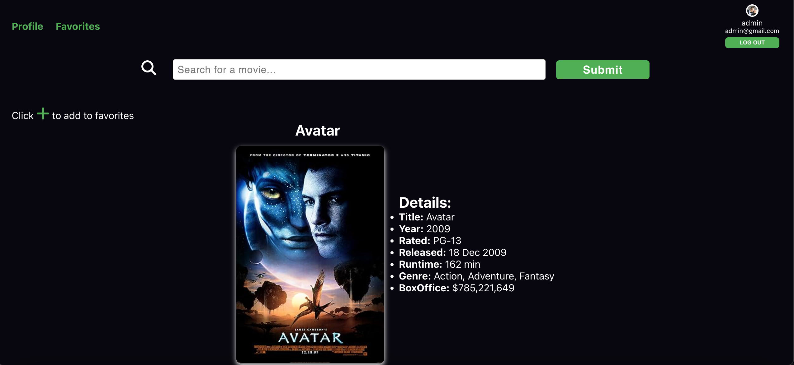
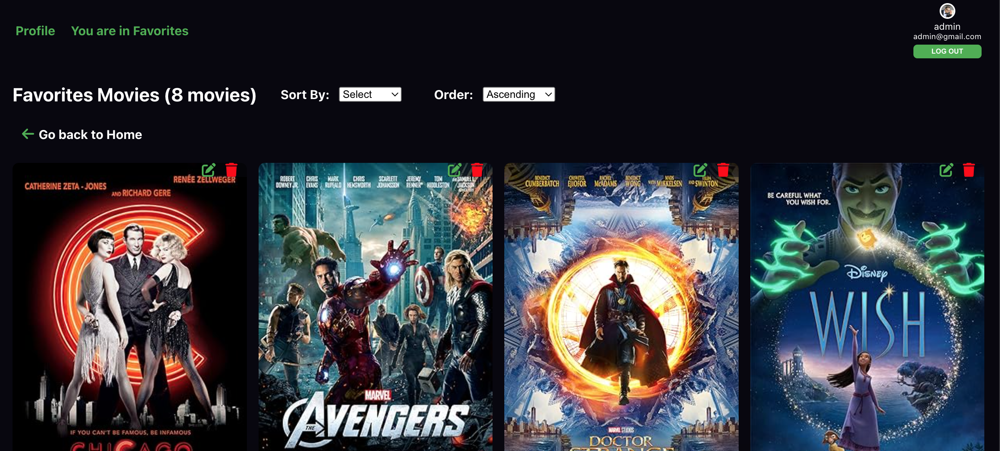
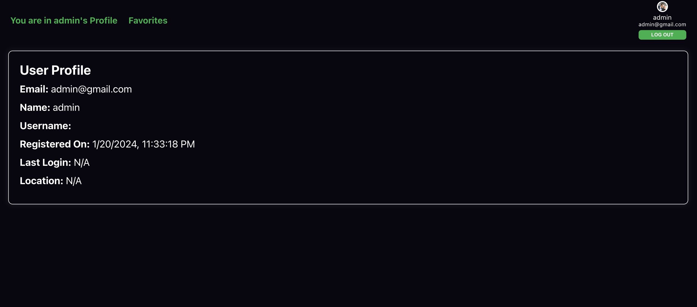
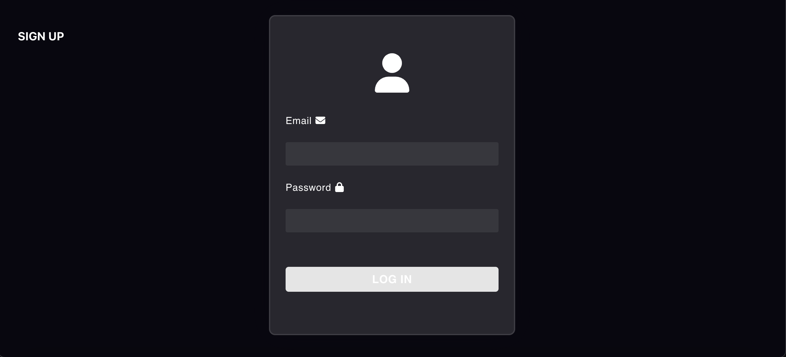

# Movie API and Favorites

Welcome to the Movie API and Favorites project. This project provides a platform for interacting with a movie API, allowing users to explore a variety of movies and create a personalized list of favorite movies.

## Table of Contents
1. [Introduction](#introduction)
2. [Features](#features)
3. [Project Structure](#project-structure)
4. [Installation](#installation)
5. [Technologies Used](#technologies-used)
6. [API Endpoints](#api-endpoints)
7. [Usage](#usage)
8. [Documentation](#documentation)
9. [Screenshots](#screenshots)

## Introduction

The Movie API and Favorites project is designed to provide a movie browsing experience and enable users to maintain a list of their favorite movies. It utilizes a movie API to fetch movie details and allows users to manage their favorite movies.

### Note
This project is part of a comprehensive training cohort website. All images and concepts utilized are unrelated to any specific organization or advertising service.

## Features

- **Movie API Integration**: Explore a diverse range of movies through an external movie API.
- **Favorites Management**: Create and manage a list of favorite movies.
- **User Authentication**: Ensure a personalized experience with secure user authentication.
- **CRUD Functionality**: Utilize functionality for CRUD operations through API routes.
- **Backend Structure**: Understand the project's backend structure, including routes and models.

## Project Structure

The application is organized into distinct sections to enhance navigation and contribution:

- `src/routes/api`: Routes from the backend to frontend for different elements in the app.
- `src/models/api`: Functionality for CRUD operations.
- `src/config`: Connection to the database and different schema.
- `src/utilities`: Utilities aiding in authentication and routing between the server and the frontend.

## Layout
### Screenshots
Include screenshots of different sections or pages of your project.






## Installation

To set up the project, follow these steps:

```bash
# Install Nodemon for server
npx nodemon server

# Start the development server
npm start

